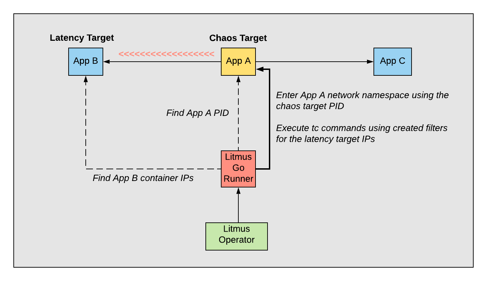

# Network experiment with Litmus Go runner

## Use case
The goal of this experiment is to provide the ability to introduce latency between the target application and one or more of its dependencies. For example, given we have Application A that communicates with B, C, and D, we want to have the option to introduce latency between A and B without affecting C and D.

The requirement we have apart from the granularity is the ability to find the targets in Openshift 4, which means using CRI-O implementation.

## Architecture and implementation
In this experiment we make use of existing APIs and packages to find the right targets and information with minimum amount of rewriting functionality. We use Litmus to orchestrate the experiment, the Kubernetes Go Client to find the right targets in the cluster, nsenter to enter the target's network namespace and tc/netem to create the latency. Eventually, we will need to be able to find targets outside of the cluster, but the implementation details are still not clear. The diagram below, shows the architecture:

**There are no required packages to be installed in the target applications. The Litmus Go runner, already has the required packages.**

### Experiment logic
Initially, we need to find the container process IDs of the chaos target application pods as the main goal is to enter their network namespaces. The reason being that we need to create latency in the exact interface of the target app, as otherwise we will not be able to find the right target IPs. We can find the PIDs via using crictl. For that, we require certain privileges in the pod which are explained in the next section.

After finding the PIDs, we need to find the latency target IPs. We can do that via using the Kubernetes Go client using the new variables from the pod spec, when the targets are in the cluster as well.

In case of external dependencies, we need to find the appropriate IPs using, for example, DNS. The exact way to do this operation is still to be defined. 

Now that we have both chaos and latency targets defined, we can start creating the latency. We use nsenter with the specified PIDs to enter the network namespace and then execute tc commands to create the appropriate queue disciplines, filters and classes.

Finally after the experiment is done, the network returns to the original state while removing all the created resources.

### Implementation details

The runner needs to be created in the same node as the target, the reason being the use of `crictl inspect` which will list all the containers running in the host. This means that, ideally we need a `nodeSelector` in order to ensure that the runner will run on the right node. 

There are several important additions (apart from the new variables or command to execute on startup).
* **hostPID:true** - This is needed in order to enable nsenter to enter the target network namespace. Without this, nsenter cannot see the container PIDs on the host
* **nodeSelector** - We need to create the pod in the same node as the target application. The simplest recommended way to do this is with a nodeSelector label.
* **NET_ADMIN** - Needed to allow use of tc from the runner
* **privileged** - Needed to allow modification of tc disciplines
* **Mount to crio.sock** - Mounting to the socket is needed to allow crictl to find the right container PID
* **Mount to crictl.yaml** - Mounting to the crictl config is needed as we are using crictl in the source code

These are the minimum prerequisites for the runner to perform network experiments. We could of course add those only in the case of network experiment and not in other experiments that do not need them.

In addition, it is important to mention once more that the runner would need the above privileges only for the duration of the experiment. Once the experiment is concluded, the runner will be deleted immediately along with any extra objects that were created for the experiment (meaning custom resources, service accounts, etc).

### Limitations
This experiment focuses only on latency. To add other functionalities (packet loss etc) we need to create a tc library. 

This experiment is tested on a local openshift 4 cluster.
