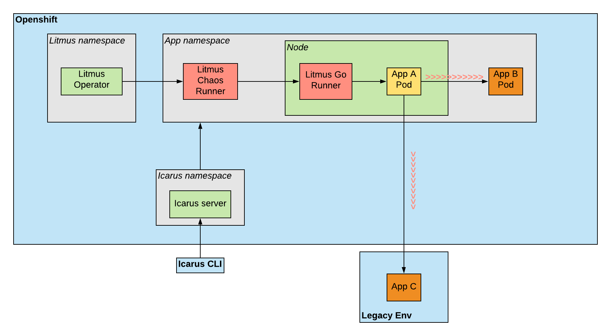

# Network experiment with Litmus Go runner

## Use case
The goal of this experiment is to provide the ability to introduce latency between the target application and one or more of its dependencies. For example, given we have Application A that communicates with B, C, and D, we want to have the option to introduce latency between A and B without affecting C and D.

The requirement we have apart from the granularity is the ability to find the targets in Openshift 4, which means using CRI-O implementation.

## Architecture and implementation
In this experiment we make use of existing APIs and packages to find the right targets and information with minimum amount of rewriting functionality. We use Litmus to orchestrate the experiment, the Kubernetes Go Client to find the right targets in the cluster, nsenter to enter the target's network namespace and tc/netem to create the latency. Eventually, we will need to be able to find targets outside of the cluster, but the implementation details are still not clear. The diagram below, shows the architecture:


From Litmus point of view, we introduce two new variables: Latency Namespace (the namespace where the latency target app exists) and Latency Label (the label of the app(s) to target). It need to be mentioned that on the contrary with the latency targets which could be anywhere, the chaos target app needs to be in the cluster, as all the applications that Litmus introduces chaos to. 

**There are no required packages to be installed in the target applications. The Litmus Go runner, already has the required packages.**

### Experiment logic
Initially, we need to find the container process IDs of the chaos target application pods as the main goal is to enter their network namespaces. The reason being that we need to create latency in the exact interface of the target app, as otherwise we will not be able to find the right target IPs. We can find the PIDs via using crictl. For that, we require certain privileges in the pod which are explained in the next section.

After finding the PIDs, we need to find the latency target IPs. We can do that via using the Kubernetes Go client using the new variables from the pod spec, when the targets are in the cluster as well.

In case of external dependencies, we need to find the appropriate IPs using, for example, DNS. The exact way to do this operation is still to be defined. 

Now that we have both chaos and latency targets defined, we can start creating the latency. We use nsenter with the specified PIDs to enter the network namespace and then execute tc commands to create the appropriate queue disciplines, filters and classes.

Finally after the experiment is done, the network returns to the original state while removing all the created resources.

### Implementation details

The image below displays how the above logic will be implemented. The experiment will be executed the same way as any other Litmus experiment which is using the Litmus Go runner. 



As shown above, Icarus will be the responsible one to trigger and orchestrate the experiment. Once the proper variables are passed from the user, Icarus will apply the right CRDs to the right namespaces. It is important to repeat that we are entering a specific's pod network namespace. This means in case of multiple Pods, we need to repeat the process for each target. This can be done either:
* From Icarus via identifying the targets and created equally many chaosengines
* From Litmus Go in a serial way - one Pod after another
* From Litmus Go in a parallel way - running for all Pods concurrently

In any case, the privileged on the cluster level don't change. What will change is only the number of chaos pods to deploy per experiment.

An important point is that the runner needs to be created in the same node as the target, the reason being the use of `crictl ps` which will list all the containers running in the host. This means that, ideally we need a `nodeSelector` in order to ensure that the runner will run on the right node. 

There are several important additions (apart from the new variables or command to execute on startup).
* **hostPID:true** - This is needed in order to enable nsenter to enter the target network namespace. Without this, nsenter cannot see the container PIDs on the host
* **nodeSelector** - We need to create the pod in the same node as the target application. The simplest recommended way to do this is with a nodeSelector label. Icarus would need to attach this label once it identifies the target app.
* **NET_ADMIN** - Needed to allow use of tc from the runner
* **privileged** - Needed to allow modification of tc disciplines
* **Mount to crio.sock** - Mounting to the socket is needed to allow crictl to find the right container PID
* **Mount to crictl.yaml** - Mounting to the crictl config is needed as we are using crictl in the source code

These are the minimum prerequisites for the runner to perform network experiments. We could of course add those only in the case of network experiment and not in other experiments that do not need them.

In addition, it is important to mention once more that the runner would need the above privileges only for the duration of the experiment. Once the experiment is concluded, the runner will be deleted immediately along with any extra objects that were created for the experiment (meaning custom resources, service accounts, etc).

### Litmus CRDs

Currently, Litmus is not able to allow the specification of security context and capabilities in a Litmus object. This is ongoing work from the Litmus maintainer, which is expected mid July 2020. This needs to be implemented before we can have a full workflow of the experiment. However, a workaround for now is via applying directly the Kubernetes job spec, while the chaos runner is running. Such a job spec is below:

```
apiVersion: batch/v1
kind: Job
metadata:
  labels:
    experiment: network-latency
  name: network-latency-feidyd
  namespace: za-purchase-prelt
spec:
  template:
    metadata:
      labels:
        experiment: network-latency
        job-name: network-latency-feidyd
      name: network-latency-feidyd
      namespace: za-purchase-prelt
    spec:
      hostPID: true
      containers:
      - args:
        - -c
        - ./network
        command:
        - /bin/bash
        env:
        - name: APP_NAMESPACE
          value: za-purchase-prelt
        - name: APP_LABEL
          value: app-name
        - name: APP_KIND
          value: deploymentconfig
        - name: TOTAL_CHAOS_DURATION
          value: "30"
        - name: LIB
          value: litmus
        - name: CHAOSENGINE
          value: app-chaos
        - name: CHAOS_NAMESPACE
          value: za-purchase-prelt
        - name: LATENCY_NAMESPACE
          value: za-customer-prelt
        - name: LATENCY_LABEL
          value: app-label
        - name: POD_NAME
          value: ""
          valueFrom:
            fieldRef:
              apiVersion: v1
              fieldPath: metadata.name
        nodeSelector:
          chaos: network
        volumeMounts:
        - name: cri-socket
          mountPath: /var/run/crio/crio.sock
        - name: cri-config
          mountPath: /etc/crictl.yaml
        image: andreas131989/litmus-go:ci
        imagePullPolicy: Always
        name: network-latency-feidyd
        securityContext:
          capabilities:
            add: ["NET_ADMIN"]
          privileged: true
      volumes:
      - hostPath:
          path: /var/run/crio/crio.sock
        name: cri-socket
      - hostPath:
          path: /etc/crictl.yaml 
        name: cri-config
      serviceAccount: network-latency-sa
      serviceAccountName: network-latency-sa
```

### Permissions and RBAC

To perform the expreriments (in general) there are three actors involved in terms of required permissions in the cluster:

* **Icarus** - Icarus needs to be able to create the right service account, role and rolebinding of each experiment in all the target namespaces. Depending on how we want to find external target IPs, Icarus might also need to be able to find those IPs. Also it will be needed to find the right node to deploy the runner using nodeSelector. These last two points, will need more privileges than the ones currently held (the current RBAC is [here](https://axinic.central.inditex.grp/bitbucket/projects/SRECHAOS/repos/icarus-chaos-requirements/browse)).
* **Litmus Operator** - Litmus needs to be able to create the chaos pods in the target namespaces. (the current RBAC is [here](https://axinic.central.inditex.grp/bitbucket/projects/SRECHAOS/repos/litmus-operator-manifests/browse)).
* **Litmus Go runner** - The runner needs to be able to be created as a pod with the required configuration (in the network experiment case, with the above privileges).

### Limitations
This experiment focuses only on latency. To add other functionalities (packet loss etc) we need to create a tc library. 

This experiment is tested on a local openshift 4 cluster. We still need to validate it (especially regarding permissions) with the Openshift 4 PRE cluster in Inditex.


### Alternative

The alternative way to implement the network experiment is similar to Pumba. This would mean that we will have to use cri-o golang packages to create an extra helper pod with the right privileges and configuration in the target namespace and node. This on one hand would enable us to not modify the operator but on the other hand will create a 3rd pod just to execute a single experiment (along with implementing cri-o). Note, that the pod spec will remain the same in this case.

## Next steps - Improvements

There are several improvements that are required to be implemented:
* Create the chaoslib for network latency as per the standards of other experiments
* Create the chaos experiment for network latency as per the standards of other experiments
* Modify the operator to allow the addition of needed fields mentioned above (hostPID, security context, nodeSelector, socket mount)
* Create the Litmus CRDs for the experiment (rbac, chaosexperiment, chaosengine)
* Implement deletion of the created queue disciplines after chaos duration is over or the experiment is stopped
* Optimise the choice of the container PID when there are more than 1 pods in the target 
* Implement loop to create more filters for all the latency target IPs (now we assume only 1 for simplicity)
* Improve the use of tc + nsenter (maybe via a wrapper)
* Improve reporting after tc has started (maybe nsenter + ping target or something)
* Implement tc library (latency, packet loss, etc)

